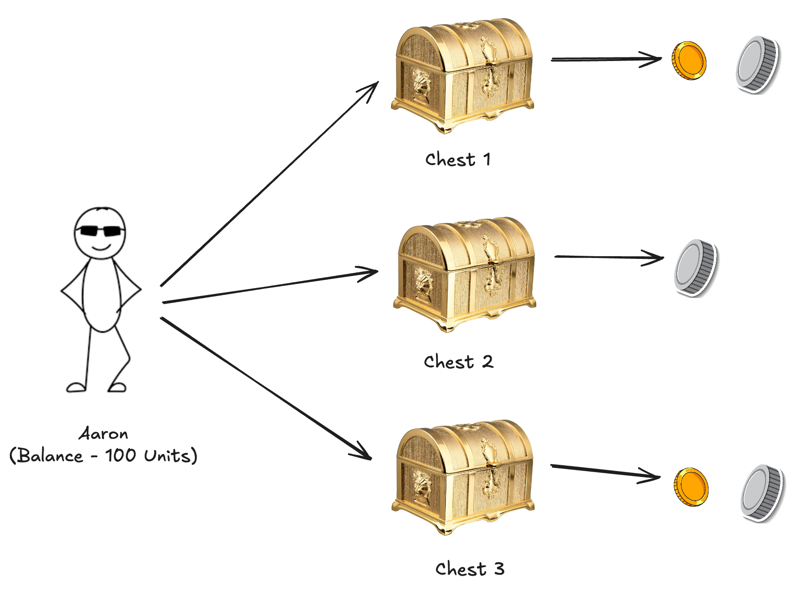
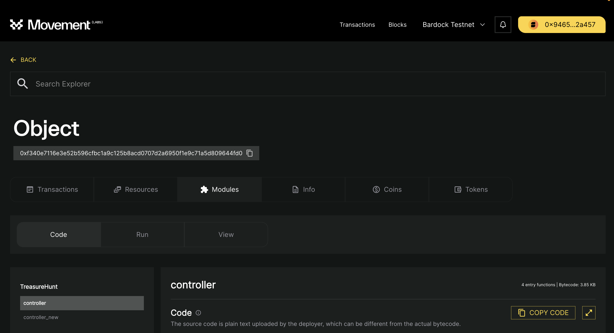

# DeMystifying Objects

Till now, we have got a basic understanding about the Move Language. We talked about how to use global storage, understood how it is different from various other languages and what new it offers and talked about some fundamental basics.

Moving forward, we will focus on tackling real life use-cases with the help of more module provided by the Movement ecosystem. So today, we are going to talk about Objects, what are they and why are they so useful.



Let's build our own treasure hunt package where users can setup there account with some balance. Users can create multiple chests linked to their account and can mint silver and gold coin in there chests untill their balance is exhausted.

## Setting up

Let's setup our code. As learned in the previous [section](PublishPackage.md), let's try to deploy the code present in folder [treasure-hunt](../demos/treasure-hunt). Post deployment we see that a new `controller` module belonging to package `TreasureHunt` has been added under our address.


This is very convenient for us, however as and when the complexity of our code grows maintaining multiple packages under same deployment won't be a scalable solution. Also, from the architectural perspective `HelloMove` and `TreasureHunt` serve completely different purposes and since both the packages are under same address it can can cause a lot of confusion for end users. There is a very high chance that both the packages can have modules with same name in future which would make future upgrades impossible.

So how can one tackle this? Do we need to create a new account for deployment of any new package which is unrelated from an existing package? This is also not scalable.

**What are Objects?**

One can instruct Movement to create address spaces separate from any existing allocated addresses to deploy there packages. These address spaces are called **Objects**. Accounts can create new objects and store resources under address space allocated to that object.

**Object Based Deployments**

Movement has created an abstraction on top of **Object** to enable developers to publish packages under these object address. This means that no one will ever have the hassle to create new account for deployment of any new package. Objects are also flexible in terms of ownership, package publishers can give ownership away to other accounts to manage these object based deployments further.

So how can we use objects based deployments. One can directly call the command shown below and they will get the address to the package deployed in the CLI output.

```bash
movement move  create-object-and-publish-package --address-name TreasureHunt
```

On calling the above command we get the following output.

```bash
Compiling, may take a little while to download git dependencies...
UPDATING GIT DEPENDENCY https://github.com/aptos-labs/aptos-core.git
INCLUDING DEPENDENCY AptosFramework
INCLUDING DEPENDENCY AptosStdlib
INCLUDING DEPENDENCY MoveStdlib
BUILDING TreasureHunt

Do you want to publish this package at object address 0xf340e7116e3e52b596cfbc1a9c125b8acd0707d2a6950f1e9c71a5d809644fd0 [yes/no] >
yes
package size 4451 bytes
Do you want to submit a transaction for a range of [323100 - 484600] Octas at a gas unit price of 100 Octas? [yes/no] >
yes
Transaction submitted: https://explorer.movementlabs.xyz/txn/0x4ec3444cd4c53012925ee02153a403f46aa2420de1d03860bc332af21cc84602?network=custom
Code was successfully deployed to object address 0xf340e7116e3e52b596cfbc1a9c125b8acd0707d2a6950f1e9c71a5d809644fd0.
{
  "Result": "Success"
}

```

The CLI gives us the object address where the package is published. But how does it know to substitute the alias `TreasureHunt` with object address.

```toml
[addresses]
aptos_framework = "0x1"
TreasureHunt = "_"
```

If you look at the `Move.toml` file `TreasureHunt` has been assigned a wildcard `_`. When the command `create-object-and-publish-package` is called with the argument `address-name` having value `TreasureHunt` it replaces the occurance of the alliance with the object address.



If we go to the explorer we could see the the package is published under the address shown in the CLI's output. However, rather than being marked as `Account` the address is marked as `Object`. This is a very important distinction to note.

## Motivation

Before, we do a deep dive into our code-base. It's important to understand why are we using `Objects`. We have studied about global storage and resources in-depth, even though native functions provided by Move language is great for storing and retrieving resources from global storage but are limited in usage. One can write abstractions around them to achieve their end goals but one would end up writing a lot of boiler plate. Let's discuss about some of those concerns-

- **Lack of Security** - Whenever we call `move_to` to move a resource to global storage, any user or the package deployer can edit those resources since one requires only the address of the user which created that resource to edit/delete the Resource. Global operators don't guarantee security.
- **Lack of Ownership** - Whenever one moves the resource to global storage, it only has one owner the creator of the resource. There is no way to transferring ownership to another user without writing any boilerplate. Also in-case one wants to assign another resource as the owner of the new resource that is also not possible.
- **Access Control** - In highly secure applications one would require stringent access to what all actions are possible on a resource post it's creation. Is the resource editable, deletable or transferrable? These are properties which should be defined only at the time of creation or controlled only by the creator neither the package publisher nor any other user.
- **Conflicting Abilites** - Move is a very restrictive language in sense of defining the ability of any resource. When storing or transferring resources across various packages, just by directly moving the structs across can cause issues with newer packages as the resources might want certain abilities to be honored which would enforce one to tweak their own package architecture. One would require an abstraction around that resource which is very flexible but also guarantees the ability of underlying types being honoured.

## Summary

Today we learnt about,

- How to use object based deployments to publish packages
- What is object and how is it different from accounts
- What is the motivation behind using an object

As an assignment to the reader, one can go through the code base in `treasure-hunt` folder and try to get gist of what is being written.

## Resources

- [Object Based Deployments](https://aptos.dev/en/build/smart-contracts/deployment#deploy-code-to-an-object)
- [What Are Objects?](https://aptos.dev/en/build/smart-contracts/objects)
