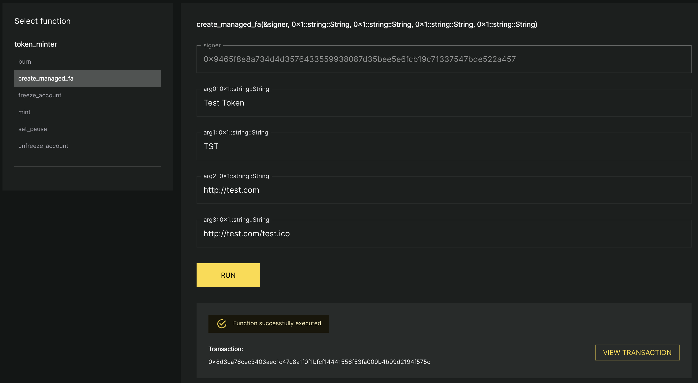
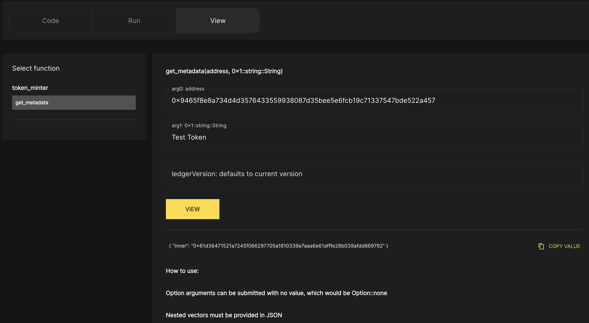
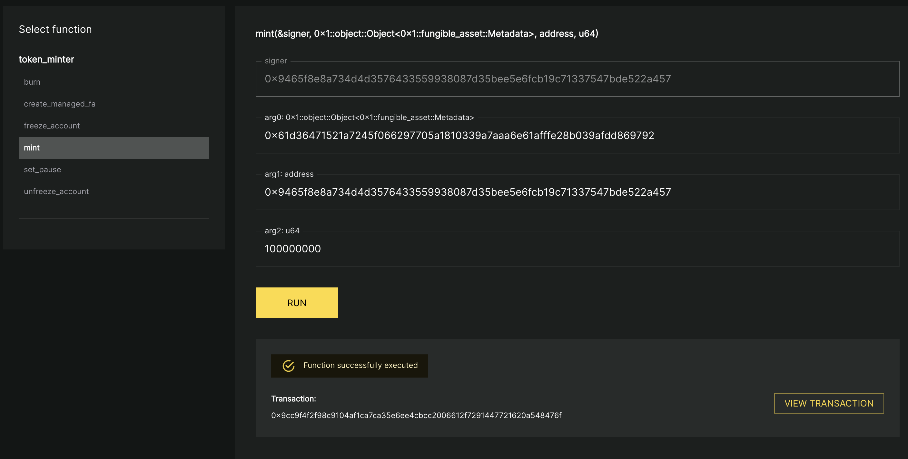
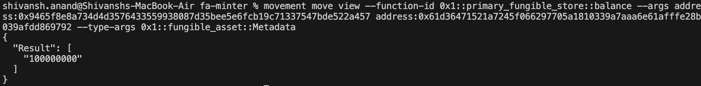

# Introduction to Fungible Assets

Hi Everyone, we are back with another interesting project. Till now, we talked about some utility libraries like String, Vectors and Smart Tables. Now as we move onto complex topics having basic understanding about these utilities is very important.

Moving on, any blockchain is non-existent without tokens. All the modern day blockchains have some sort of token standard be it ERC20 in Ethereum, Tokens in Solana and so forth. Movement also has it's own set of Token standards for various use cases.

## Token Standard in Movement

Movement as 4 types of token standards for various use-cases. Apart from that it also also core modules which users can leverage to create assets following the standard. These are as follows -

- **Fungible Assets** - As the name suggests, fungible assets are assets which are fungible in nature as in their copies and be created and destroyed.
- **Digital Assets** - These are assets which are non fungible in nature, each asset minted is unique from other asset. They can be considered analogus to NFTs in other blockchain.
- **Coin** - This is a legacy standard used to create various coins in Movement ecosystem. Although the standard is still supported it is recommended to use Fungible Asset standard for newer use cases.
- **Token** - This is a legacy standard used to create various NFTs in Movement ecosystem. Although the standard is still supported it is recommended to use Digital Asset standard for newer use cases.

## Fungible Assets


Today, we will be discussing about Fungible Asset standard in detail and talk about how to use our [FAMinter](../demos/fa-minter/) package to create and deploy your own fungible asset tokens. In brief, fungible asset work with the help to two Move Objects.

1. `Object<Metadata>` - This represents details about the fungible asset itself, including information such as the `name`, `symbol`, and `decimals`.
2. `Object<FungibleStore>` - This stores a count of fungible asset units owned by this account. Fungible assets are interchangeable with any other fungible asset that has the same metadata. An account *may* own more than one `FungibleStore` for a single Fungible Asset, but that is only for advanced use cases.

Each user holding a Fungible Asset will have their own fungible store which holds all the important information about that user i.e. balance of FA, is account frozen, etc.

## Deployment and Usage

Deploying the package is straight forward or you can use our existing package as with the steps mentioned in [README](../demos/fa-minter/README.md). Post deployment we can perform following operations.

### Creating our own FA



Users can call `create_managed_fa` to create there own Fungible Asset. The function expects the following details -

- `Name` - Name of the token.
- `Symbol` - Symbol of the token.
- `project_url` - The project url of the token.
- `icon_url` - The url for icon of the token.

There are many more properties required to create a fungible asset which are number of decimals, total supply, etc. But we have abstracted that implementation under `create_managed_fa` function.

### Fetching Metadata

For any token created there would be a Metadata object stored at an address. User's can use this Metadata to pinpoint to the Fungible Asset for which they want to perform operation. These operations could be `mint`, `burn`, `freeze`, `unfreeze` and many more. Metadata is critical to identify the token.



In our package user can call `get_metadata` view function and pass in the `creator_address` and `name` of the token to fetch the address of the metadata present in the `inner` field.

### Minting, Burning of Tokens



User's can call `mint` function passing in the `metadata_address`, `to` account where token is going to be minted and `amount` to be minted. Note that, depending on the value of decimal field determines the denonimation of the token. In our case `100000000` value equates to the user minting 1 token.

**Note**

_Only the token creator can call the mint function since only they are the owner of Metadata object._

### Fetching Balance



Finally user's can call the utility function `balance` under `primary_fungible_store` module to fetch the balance for the given asset. The output shown as above. In verbose the command is as follows.

```bash
movement move view --function-id 0x1::primary_fungible_store::balance \
--args address:<metadata_address> address:<account_address> \
--type-args 0x1::fungible_asset::Metadata
```

Here the metadata 

## Resources

- [Assets in Aptos](https://aptos.dev/en/build/smart-contracts/digital-asset)
- [Creating Fungible Assets](https://aptos.dev/en/build/smart-contracts/fungible-asset#creating-a-new-fungible-asset-fa)
- [Fungible Assets Uilities](https://aptos.dev/en/build/smart-contracts/fungible-asset#reference-docs)
- [Fungible Asset Source Code](https://github.com/aptos-labs/aptos-core/blob/main/aptos-move/framework/aptos-framework/sources/fungible_asset.move)
