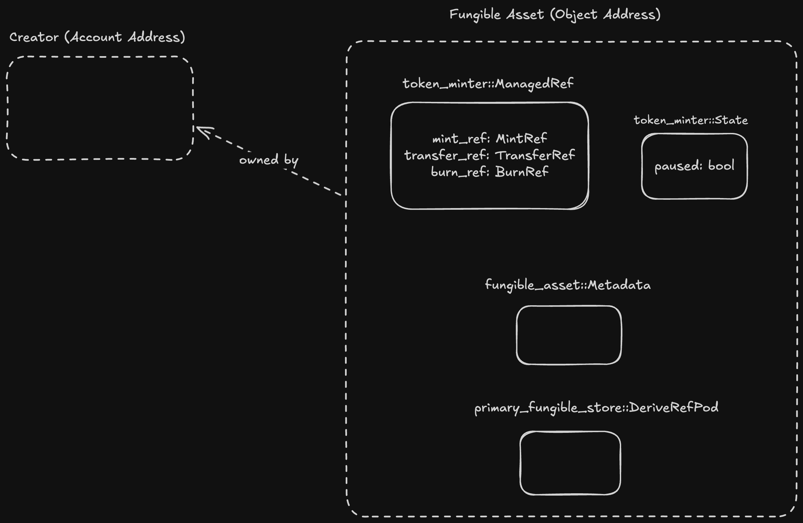

# Fungible Assets: Creation, Control and Supply

Hello Guys, on [day 15](FungibleAssets1.md) we talked about [fa-minter](../demos/fa-minter) package and how to use it to deploy, mint and manage your own FA tokens. Today, we will discuss about the package code in detail and explain how you can create your own FA tokens from scratch and maintain it's supply.

## Understanding Basics

If one is familiar with [Objects](ObjectBasics.md), it is very easy to understand the architecture of Fungible Assets as it built on top of it. The architecture for Fungible assets can be summarised as follows, user who own the Metadata of the FA can perform various operations on FA i.e minting/burning, freezing accounts and many more.

At the time of creation of FA user's can extract and store various [Refs](ObjectBasicsII.md) which can permit respective operations on FA in future.

### Creation of Fungible Assets

As explained earlier, users can call the function `create_managed_fa` in [token_minter.move](../demos/fa-minter/sources/token_minter.move) to deploy there own FA. The function works as follows,

```Move
public entry fun create_managed_fa(
    sender: &signer, 
    name: String, 
    symbol: String, 
    icon_uri: String, 
    project_uri: String
) {  
    let object_address = object::create_object_address(&signer::address_of(sender), *bytes(&name));
    let fa_exists = object::object_exists<ManagedFungibleAsset>(object_address);
    assert!(!fa_exists, error::already_exists(ECOIN_EXISTS));

    let constructor_ref = &object::create_named_object(sender, *bytes(&name)); 

    // Create the FA's Metadata with your name, symbol, icon, etc.
    primary_fungible_store::create_primary_store_enabled_fungible_asset(
        constructor_ref,
        option::none(),
        name,
        symbol,
        8,
        icon_uri,
        project_uri
    );

    // Generate all the ref
    let mint_ref = fungible_asset::generate_mint_ref(constructor_ref);
    let transfer_ref = fungible_asset::generate_transfer_ref(constructor_ref);
    let burn_ref = fungible_asset::generate_burn_ref(constructor_ref);

    let metadata_object_signer = object::generate_signer(constructor_ref);
    let managed_ref = ManagedFungibleAsset { mint_ref, transfer_ref, burn_ref };

    // Store the ref and FA State in same address as that of FA metadata.
    move_to(
        &metadata_object_signer,
        managed_ref
    );

    move_to(
        &metadata_object_signer,
        State { paused: false }
    );
}
```

The creation of token can be broken down into following steps.

1. First, we create an object for the creator using `object::create_named_object`. This assigns an object address to the creator with a `ConstructorRef`.
2. We call `primary_fungible_store::create_primary_store_fungible_asset` passing the `ConstructorRef` to create `Metadata` at object address assigned earlier. The owner of the `Metadata` is the creator itself and holds all the neccessary information about the Fungible Asset.
3. Finally, we use the same `ConstructorRef` to derive various `Refs` to enable various behaviour on the Fungible Asset. We can extract the `Refs` only at the time of creation, restricting the creator to modify the behaviour of the token in future. This making Fungible Asset a very safe standard.

**primary_fungible_store::create_primary_store_fungible_asset**

The function contains number of important arguments let's understand the arguments in detail in the order it is present.

- `constructor_ref` - This argument takes in the `&ConstructorRef` of the object address assigned to the creator.
- `maximum_supply` - This argument takes in `Option<u128>` and depicts the total mintable supply of the token . We have passed `option:none()` depicting unlimited token supply. User's can also enter a fixed value to have a limited supply.
- `name` - This argument takes in `String` and is the name of the token.
- `symbol` - This argument takes in `String` and is the symbol of the token.
- `decimals` - This argument takes in `u8` defining the total decimals places the token balance requires. For eg. if `decimals` is 5, a token balance of `100000` means that user can 1 token, in case the token balance is `1000` it means that the user has 0.01 token. In our case we have hardcoded the value as 8 as that is the standard for majority of DeFi protocols in Movement ecosystem.
- `icon_uri` - This argument takes in `String` depicting the URL for the icon.
- `project_uri`- This argument takes in `String` depicting the project URL for the Fungible Asset.

**Note**

_Any protocol or wallet need to adhere to the field values in the Metadata in order to be compatible with the **Fungible Asset** standard. The packages itself have no validation on these fields, hence it's very important to put valid values in the field._

### Defining Token Behaviour

On the third step of token creation, we extract out various `Refs` as shown below.

```Move
let mint_ref = fungible_asset::generate_mint_ref(constructor_ref);
let transfer_ref = fungible_asset::generate_transfer_ref(constructor_ref);
let burn_ref = fungible_asset::generate_burn_ref(constructor_ref);
```

These `Refs` can be used to perform various operations in future.

- `MintRef` - This ref is used to mint token to a given account.
- `BurnRef` - This ref is used to burn token from a given account.
- `TransferRef` - This ref is used to freeze/unfreeze a given account thereby restricting them from sending or receiving tokens. This `Ref` can also be used to Transfer balances from one user to another permissionlessly, this can be useful to create smart wallets for a given Fungible Asset.

There are many more `Refs` present in `fungible_asset` package which users can to modify Metadata, balance fetching and much more.

Post calling `create_managed_fa` the address space will looks like shown below.



Since the metadata is stored at a deterministic address. One can fetch the `Object<Metadata>` using `object::create_object_address` as shown in `get_metadata` function.

We have also added a `State` resource which pause/unpauses a token state thereby restricting any token to be minted or burned in case of a breach. This is a safety mechanism which should be added in creation of any financial asset.

### Maintaining Supply

If we look at the `mint` function.

```Move
 public entry fun mint(admin: &signer, metadata: Object<Metadata>, to: address, amount: u64) acquires ManagedFungibleAsset, State {
    assert_not_paused(metadata);
    assert_metadata_owner(admin, metadata);

    let mint_ref = &get_fa_ref(metadata).mint_ref;
    let to_wallet = primary_fungible_store::ensure_primary_store_exists(to, metadata);
    fungible_asset::mint_to(mint_ref, to_wallet, amount);
}
```

We perform the following steps.

- Perform basic checks on the token state and ensuring only the creator calls the `mint` function
- Get `MintRef` for the FA present at the `Metadata` address.
- Create or use an existing `FungibleStore` for the given fungible asset and `to` user combination using `primary_fungible_store::ensure_primary_store_exists`.
  - This function derives an object address using the user's address and FA metadata address.
  - Then it creates a `FungibleStore` resource at the given address.
  - `FungibleStore` stores the balance the user for a given FA. Note that, the user for which the store is created is the actual owner of the object address. This ensures, that user has complete control over the store object.
- Once we get the `FungibleStore`, we can then pass the `MintRef` to `fungible_asset::mint_to` function to mint FAs on the `to` user address.

Creators can perform same steps to burn FAs from a user's account just by using `BurnRef` and `fungible_asset::burn_from` function respectively. Refer to `burn` function in [token_minter.move](../demos/fa-minter/sources/token_minter.move).

### Token Guardrails

FA creators can call `set_pause` function to pause or unpause their FAs as shown below.

```Move
// Pause or UnPause a given FA i.e creator can mint/burn a given asset or not
    public entry fun set_pause(pauser: &signer, metadata: Object<Metadata>, paused: bool) acquires State {
    assert_metadata_owner(pauser, metadata);
    let state = get_state(metadata);
    if (state.paused == paused) { return };
    state.paused = paused;
}
```

The code is self-explanatory, if you have been following our previous material. Currently, we use `State` only to control the `mint` and `burn` behaviour.

**Note**

_If one needs to introduce the `pause` field to control deposit and withdrawal behaviour Movement also provides implemention of hooks using `FunctionInfo` and `dispatchable_fungible_asset` package which we will cover in future._

### Having Control

We can also freeze and unfreeze individual user's accounts using the `TransferRef`. This is useful in cases where we want to block malicious accounts from accepting any FA or transfer their FAs to another user. We do this by calling `freeze_account` and `unfreeze_account`.

```Move
// Freeze FA account of a given user i.e. user can't deposit or withdraw this FA.
public entry fun freeze_account(admin: &signer, metadata: Object<Metadata>, account: address) acquires ManagedFungibleAsset {
    assert_metadata_owner(admin, metadata);

    let transfer_ref = &get_fa_ref(metadata).transfer_ref;
    let wallet = primary_fungible_store::ensure_primary_store_exists(account, metadata);
    fungible_asset::set_frozen_flag(transfer_ref, wallet, true);
}
```

The steps followed are very similar to `mint` and `burn`.

- Once we have extracted the `TransferRef` and `FungibleStore` for the user.
- We call `fungible_asset::set_frozen_flag` which takes in the `TransferRef` to freeze the user's store from further interacting with the token.

To `unfreeze` as account we need to perform similar steps just with minor changes as present in `unfreeze_account` function.

## Summary

Today we talked about,

- Steps to create your own Fungible Asset.
- How to mint and burn FAs.
- Talked about security considerations and token guardrails.
- How to freeze malicious users holding the FAs.

## References

- [Fungible Assets](https://aptos.dev/en/build/smart-contracts/fungible-asset)
- [Move Example - Managed Fungible Assets](https://github.com/aptos-labs/aptos-core/blob/main/aptos-move/move-examples/fungible_asset/managed_fungible_asset/sources/managed_fungible_asset.move)
- [Fungible Assets Source Code](https://github.com/aptos-labs/aptos-core/blob/main/aptos-move/framework/aptos-framework/sources/fungible_asset.move)
