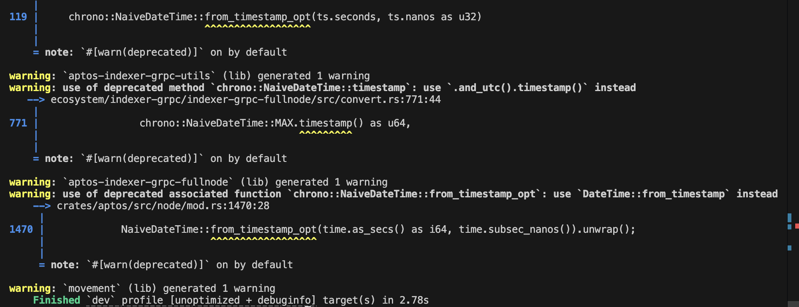
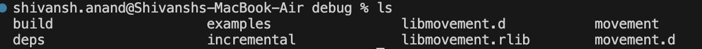
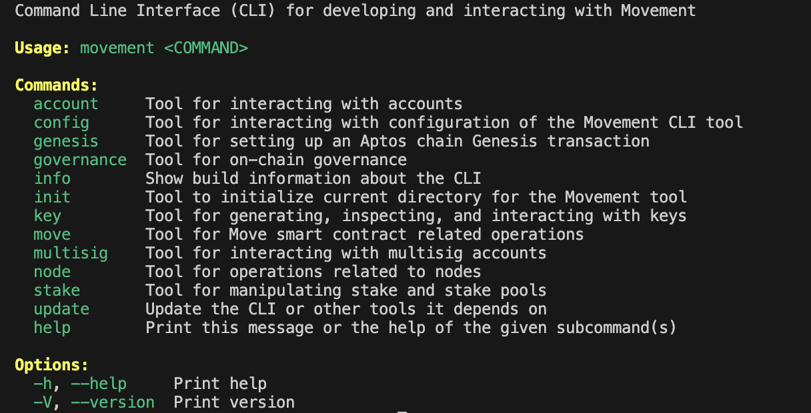

# Getting Started

Welcome, to **_100 Days of Move_** where we will learn about everything Move. This journey will help us cover all the concepts present in Move Language and charge everyone to develop and contribute to the ecosystem.

## What is Move?


**Move** is secure, verifiable and flexible programming lanugage used to write highly performant contracts on blockchain. It was intially created by a team of engineers at **Meta** as part of their blockchain initiative. Later on, Move was adopted by newer blockchains like **Aptos**, **Sui** and **MovementLabs**.

Move derives a lot of it's core principles from **Rust** and follows a similar **strongly typed**, **borrow ownership** model. The way Move language is designed the users have deep control over management of the resources borrowed, thereby allowing blockchains to **parallelize executions** of multiple Move programs at once which has led to a significant boosts in **Transaction Per Seconds** (**TPS**) for these blockchains even though the language is pretty recent.

## Setup Movement CLI

Before we can start fiddling around with movement ecosystem we have to setup an execution environment which can enable us to compile, test and deploy contracts on a Move based blockchain ecosystem.

Luckily, **Movement** has it's own highly performant and easy to use Movement CLI which we can setup on our local machine. Here I am using Apple Silicon Macbook, however for your system you can check the in-depth guide posted in the [Resources](#resources) section.

### Step 1 - Clone Movement Repository

Go to an appropriate terminal and run git clone command and navigate to the project root.

```bash
git clone https://github.com/movementlabsxyz/aptos-core/ && cd aptos-core
```

### Step 2 - Check Dependencies (Cargo and Rust)

Once in the project root check if the required dependencies are installed to build the cli. One can install all the neccessary Rust requirements by following commands -

```bash
curl https://sh.rustup.rs -sSf | sh
```

Post successful installation of Cargo and Rust the following output should be shown.

```bash
Rust is installed now. Great!
```

### Step 3 - Build Movement CLI

Run the cargo command to build movement CLI.

```bash
cargo build -p movement
```



Kindly note that for initial build the time taken could be significant however with subsequent builds it wouldn't take that long. Post build one should be able see the **movement binary** under **{PROJECT_ROOT}/target/debug**.



### Step 4 - Add to PATH

This binary can then be moved to a common PATH folder so that it can be accessed easily.

```bash
sudo cp target/debug/movement /usr/local/bin/
```

Additionally, one can call the following command to verify the installation.

```bash
movement -h
```



## Setup Movement Project

Post setup of movement CLI, one can go to location where they want to initialize their project and run the following command.

```bash
mkdir first-movement-project
cd first-movement-project
movement init
```

You can enter the following details for the prompt shown, in case one wants to setup a project for another network they can refer to [network endpoints page](https://docs.movementnetwork.xyz/devs/networkEndpoints).

```bash
Configuring for profile default
Choose network from [devnet, testnet, local, custom | defaults to devnet]. For testnet, start over and run movement init --skip-faucet
custom
Enter your rest endpoint [Current: None | No input: Exit (or keep the existing if present)]
https://aptos.testnet.porto.movementlabs.xyz/v1

Enter your faucet endpoint [Current: None | No input: Skip (or keep the existing one if present) | 'skip' to not use a faucet]
https://fund.testnet.porto.movementlabs.xyz/

Enter your private key as a hex literal (0x...) [Current: None | No input: Generate new key (or keep one if present)]
0x<YOUR_PRIVATE_KEY>

Account 0x9465f8e8a734d4d3576433559938087d35bee5e6fcb19c71337547bde522a457 has been already found onchain

---
Movement CLI is now set up for account 0x9465f8e8a734d4d3576433559938087d35bee5e6fcb19c71337547bde522a457 as profile default!
 See the account here: https://explorer.movementlabs.xyz/account/0x9465f8e8a734d4d3576433559938087d35bee5e6fcb19c71337547bde522a457?network=custom
 
            Run `movement --help` for more information about commands. 
 
            Visit https://faucet.movementlabs.xyz to use the testnet faucet.
{
  "Result": "Success"
}
```

Now run the following command to add the neccessary files.

```bash
movement move init --name hello_movement
```

Here `hello_movement` is the name of the move module. The CLI is well diverse and one could try out various other options present in the toolkit. To explore the project directory one can refer this [folder](../demos/getting-started).

## Resources<a id="resources"></a>

- [Move Origins](https://www.halborn.com/blog/post/what-is-the-move-programming-language)
- [Introduction - Move Book](https://move-language.github.io/move/introduction.html)
- [Setup Movement CLI](https://docs.movementnetwork.xyz/devs/movementcli)
- [Cargo and Rust Setup](https://doc.rust-lang.org/cargo/getting-started/installation.html)
- [Movement Network Endpoints](https://docs.movementnetwork.xyz/devs/networkEndpoints)
-
