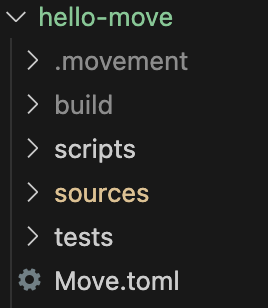
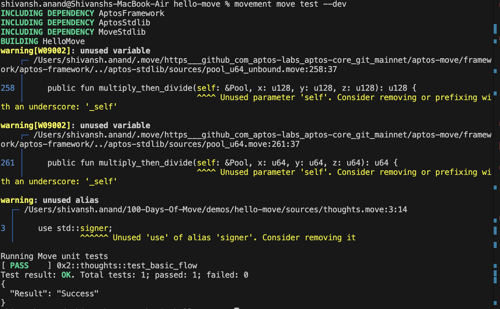

# Hello Move

Once movement CLI is all setup we can proceed with writing our first move package called _**Hello Move**_. `Hello Move` will be our first revolutionary notes dapp on movement ecosystem where users can post their notes and view them. Think it of a dapp where you can jot down your own thought of the day for the whole world to see.

## Setting up Move Package

First one will run the following command in their terminal.

```bash
mkdir hello-move
cd hello-move
```

Once in the *PROJECT_ROOT* one will initialize the movement environment calling the following commands

```bash
movement init
movement move init --name HelloMove
```

If confused about input to be given under `init` prompt kindly refer to the [Getting Started](GettingStarted.md). After running both the commands the Move Project will be initialized and



Post all the steps one can see the folder structure as shown above. Don't worry about it though we will go through all the folders one by one.

- `sources` - This is the most important folder of your project as it will contain all the neccessary `.move` files which will have your Move code in it.
- `Move.toml` - This is the so called config file for your Move project. It contains location of all the dependencies and aliases for most commonly used addresses.
- `.movement` - This folder contains `config.yaml` file which will store the public and private keys of the account which is going to deploy the project. If required one can add multiple accounts each linked to a different profile under the same config.yaml file.
- `build` - As the name suggests it contains the metadata and compiled binaries for your Move programs.

**Note:**

*If not mentioned anything during compilation, movement CLI will take the above structure as the default values for `PACKAGE_DIR` and `OUTPUT_DIR` however it is not recommended to do the same if one is not well versed with the CLI*

# Writing your First Move Code

# Updating Move.toml

Within the **PROJECT_ROOT** go to `Move.toml` and add the following details under `[addresses]` section.

```toml
[addresses]
aptos_framework = "0x1"
std = "0x1"
HelloMove = "_"
```

Here, we are aliasing `0x1` address with `aptos_framework`. In Movement blockchain the `aptos_framework`, `std` has all the core utilities required for our development and is present at `0x1` address.

`HelloMove` our package name is kept undefined with `_` and will be defined at the time of compilation/deployment.

```toml
[dev-addresses]
HelloMove = "0x2"
```

Here we are highlighting that under dev environment `HelloMove` is present at `0x2` address. This is helpful in unit-tests and other dev scenarios where we will have our package already as part of the dev enviroment.

Finally your `Move.toml` should look like this.

```toml
[package]
name = "HelloMove"
version = "1.0.0"
authors = []

[addresses]
aptos_framework = "0x1"
std = "0x1"
HelloMove = "_"

[dev-addresses]
HelloMove = "0x2"


[dependencies.AptosFramework]
git = "https://github.com/aptos-labs/aptos-core.git"
rev = "mainnet"
subdir = "aptos-move/framework/aptos-framework"

[dev-dependencies]

```

### Thoughts Module

As part of our `HelloMove` package we will create our first module called this `thoughts` module. This module will store all the thoughts for a given user and allow various users to view each other thoughts.

Within `sources` folder we will create a file called `thoughts.move`

```bash
cd sources
touch thoughts.move
```

Now we will initialize our module.

```Move
module HelloMove::thoughts {
  
}
```

Here we have defined the `thoughts` module which is present at the address aliased by `HelloMove`. In other words, if the package was deployed at address 0x2, the module definition will be replaced with `0x2::thoughts`

Now, we will start defining our struct and resources. But before that, what is struct? A struct is a collection of data members which themselves could be a struct or a native type.

```Move
module HelloMove::thoughts {
    use std::string;

    struct MyResource has key {
        thought: string::String
    }

}
```

Here we have imported the `string` module which is part for the `std` package. This module all the essential functions for converting data to and from strings.

We have created a struct called `MyResource` which has `key` ability i.e. any `MyResource `object can be stored in the `persistent global storage` which can be treated as the database of the blockchain from which values can retrieved and stored safely.

Now in order for the any user to create and store their thoughts we need to create a `public entry function` which can be treated as the entrypoint for the logic.

```Move
module HelloMove::thoughts {
    // Struct Declaration

    // User wants to publish his thoughts.
    public entry fun create_thoughts(author: &signer, thought: string::String) {
        move_to<MyResource>(author, MyResource {
            thought: thought
        });
    }
}
```

Below the struct declaration we add the following function `public entry fun create_thoughts(author: &signer, thought: string::String)` which can be broken down as follows -

- `public entry fun` - A publicly accessible function which can be invoked by any account since it has `entry` keyword. The entry modifier is designed to allow module functions to be safely and directly invoked much like scripts. This allows module writers to specify which functions can be to begin execution. The module writer then knows that any non-entry function will be called from a Move program already in execution.
- `author: &signer` - A signer argument called `author` which stores the capability of the users who is calling the function.
- `thought: string::String` - The `thought` argument stores the thought which the author wants to post in the module.

We then call `move_to` function which adds the `MyResource` object to the global storage at the address of the `author`. The `move_to` function requires a signer object because in order to store the data to an address we need to have the capability to store the data to that address.

We now add the function to fetch the thought posted at a given address of user account.

```Move
module HelloMove::thoughts {
    // create_thoughts declaration

    // User wants to see thoughts of other user.
    #[view]
    public fun get_thoughts(user: address): string::String acquires MyResource {
        borrow_global<MyResource>(user).thought
    }

}
```

Here we have view function which only has access to read data from global storage and doesn't require any move tokens to run since there is no write operation taking place on the blockchain.

This function returns `string::String` object back to ther user calling the function.

We add `acquires MyResource` as whenever we are borrowing i.e. fetching some resource from the global storage we need to inform about resource type being acquired. This helps the blockchain to ensure that the object being fetched is null safe and the reference is not dangling. We will circle back on this concept in future.

We call `borrow_global` to fetch a reference to the resource stored at that address and de-reference it and return it. De-referencing creates a copy of that resource thereby ensuring that the actual resource in the storage is not being modified.

After all the steps, final code will look like this

```Move
module HelloMove::thoughts {
    use std::string;
    use std::signer;

    struct MyResource has key {
        thought: string::String
    }

    // User wants to publish his thoughts.
    public entry fun create_thoughts(author: &signer, thought: string::String) {
        move_to<MyResource>(author, MyResource {
            thought: thought
        });
    }

    // User wants to see thoughts of other user.
    #[view]
    public fun get_thoughts(user: address): string::String acquires MyResource {
        borrow_global<MyResource>(user).thought
    }

}
```

Now any user can publish there thoughts and can view their own and other's thoughts given that they know the user's account address.

### Testing it Out

Before publishing anything to production we need to test everything is working fine and for that we will leverage the wonderful `Movement` unit testing framework.

In order to create unit-tests we need to declare the function as follows -

```Move
module HelloMove::thoughts {
    // Create and View Functions
  
    #[test(aaron = @0xcafe)]
    fun test_basic_flow(aaron: &signer) acquires MyResource {
    }
  
}
```

We have created a unit test with the name `test_basic_flow`, which is highlighted by `#[test]` annotation. This annotation helps the Movement CLI to pick the functions to be executed in unit tests. Apart from that it also helps the compiler to know which part of code to be omitted during deployment as that will take up uneccessary storage in the blockchain.

Within the test function we have added a `signer` called `aaron` whose address is `0xCAFE`. Move allows us to define mock signers in unit tests thereby saving from the headache pf creating users during each unit test. This can be done by adding the addresses with signer aliases under `#[test(name1 = @address1)] annotation and then passing it as an argument for the unit test function.

Well first create aaron's thought.

```Move
let thought = b"Hello World";
```

Now, once thought as been created we need to add to the global storage. Since the thought is in bytes format we need to convert it to string using `string::utf8` function. Using aaron's signer we store his thought to the blockchain at aaron's address.

```Move
create_thoughts(aaron, string::utf8(thought));
```

Now, we need to fetch aaron's address from his signer using `signer::address_of` function.

```Move
let aaron_address = signer::address_of(aaron); 
```

Once we have fetched the address we need to check that the thought stored at the address actually matches with `"Hello World"`.

```Move
assert!(aaron_thought == string::utf8(b"Hello World"), 1);
```

We call `assert!` function with the condition `aaron_thought == string::utf8(b"Hello World")` if the equality fails then the unit test will abort alerting something is wrong with our code.

```Move
module HelloMove::thoughts {
    use std::string;
    use std::signer;

    struct MyResource has key {
        thought: string::String
    }

    // User wants to publish his thoughts.
    public entry fun create_thoughts(author: &signer, thought: string::String) {
        move_to<MyResource>(author, MyResource {
            thought: thought
        });
    }

    // User wants to see thoughts of other user.
    #[view]
    public fun get_thoughts(user: address): string::String acquires MyResource {
        borrow_global<MyResource>(user).thought
    }

    // We should test everything before pushing to prod.
    #[test(aaron = @0xcafe)]
    fun test_basic_flow(aaron: &signer) acquires MyResource {
        // Create a thought for aaron.
        let thought = b"Hello World";

        // Store it to the blockchain.
        create_thoughts(aaron, string::utf8(thought));

        // Fetch aaron's address
        let aaron_address = signer::address_of(aaron); 

        // Get the thought at his address.
        let aaron_thought = get_thoughts(aaron_address); 

        // Check if the thought present at that address is actually "Hello World"
        assert!(aaron_thought == string::utf8(b"Hello World"), 1);
    }
}
```

This is how our final code should look like after we have incorporated all the changes.

### Checking if it Works

Finally we will run the unit test to see if everything is working. Move back to the **PROJECT_ROOT** and run the following command.

```bash
movement move test --dev
```

You should get the following output if everything works right.



As one can see the unit test `0x2::thoughts::test_basic_flow` has passed and we are ready for deployment.

# Understanding the Basics

### Move.toml

Post initialization of the project the `Move.toml` file should like this

```toml
[package]
name = "HelloMove"
version = "1.0.0"
authors = []

[addresses]

[dev-addresses]

[dependencies.AptosFramework]
git = "https://github.com/aptos-labs/aptos-core.git"
rev = "mainnet"
subdir = "aptos-move/framework/aptos-framework"

[dev-dependencies]

```

The file could look very overwhelming but we will break it down by one-by-one. One could read the file as follows -

- `[package]` - This section in the `.toml` file contains the neccessary details about the package/project such as the name of the package, version and list of authors.
- `[addresses]` - This section contains the aliases for most commonly used addresses in the move code. For example, `aptos_framework = "0x1"` implies to replace `aptos_framework` keyword with `0x1` where declared in the Move package as addresses.
- `[dev-addresses]` - Addresses declared in this section are used whenever your Move Package is compiled or ran under the dev environment using `--dev` flag. Note that, `addresses` section takes precedence over `dev-addresses` i.e. if `address` is defined under `[addresses]` are always included in the dev environment, however defining addresses for same alias under both the section will always throw an error.
- `[dependencies]` - This includes location for all the relevant dependencies' `Move.toml` file. Movement gives you freedom to define third party dependencies as part of `local` code or `git` repository. You can read more in [Resources](#resources).
- `[dev-dependencies]` - Location for dependencies to be used in dev environment.

### Basic Terminologies

Move in itself is a very deep-ecosystem and there would be some jargons which one might not have heard of in other blockchains, so let's go through it.

**Address**

Address as the name suggests helps the blockchain to locate a particular entity. It could be an user's account, code for a Move Module or a Resource. Anything which is there on the blockchain can be located if known the right address.

**Signer**


Signer is a wrapper around an address which has the capability to sign the transaction on behalf of that address.

_Imagine a rental agreement, in order for the agreement to be valid the house owner needs to sign the agreement so that the rental rights can be passed onto a tenant._

Similarly whatever actions are performed by an user on the blockchain, calling a function or deploying code every action causes some changes in the blockchain which are termed as transaction. Any transaction to be valid and executed by the blockchain should be signed by an address i.e. using it's signer object. This helps to determine address had the agency to cause the change on the blockchain.

**Packages and Modules**

A `package` is the entire Move Project, each package is defined by the `Move.toml` file it has. Any move project is structured as follows `package` -> `module\s`. Accounts can deploy and upgrade a package having multiple modules. Move has some restrictions between how different `modules` and `package` interact with each other but that is beyond the scope of this article.

A module is an individual move file on a programmatical level. Each module can have multiple functions, resources and structs linked to it.

# Note to the Readers

We have barely touched any of the concept in detail and it could be overwhelming for some. We will be revisiting `HelloMove` in detail and tackling each concept in detail in further days.

Meanwhile, get ready with your code and make sure it has passed all the test-cases, because we are gonna deploy it tomorrow and test it out on the real blockchain.

# Resources<a id="resources"></a>

- [Understanding Move.toml](https://aptos.dev/en/build/smart-contracts/book/packages#movetoml)
- [Third Party Dependencies](https://aptos.dev/en/build/smart-contracts/third-party-dependencies)
- [The Move Book - Packages](https://move-language.github.io/move/packages.html#packages)
- [The Move Book - Signer](https://move-language.github.io/move/signer.html)
- [The Move Book - Address](https://move-language.github.io/move/address.html)
- [First Move Module](https://docs.movementnetwork.xyz/devs/firstmove)
