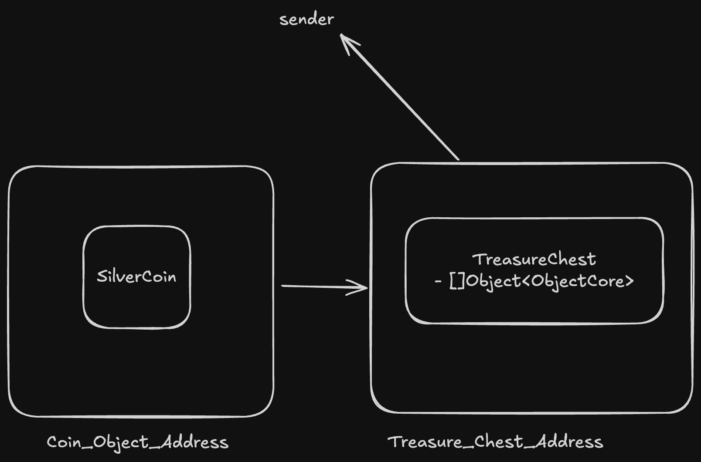

# Object Basics: Creation and Ownership

On [Day 7](DemystifyingObjects.md) we gave a brief introduction about Objects in Move language and the motivation behind using Objects framework as compared to using the Global Operators. Today, we will do a deeper dive into what is object based addressing, how to create them and get a thorough understanding of [treasure-hunt](../demos/treasure-hunt) package.

## Addressing in Move

Previously we had talked about how Move uses a tree-shaped persistant Global Storage to store data. The storage can be characterised as follows

```Move
struct GlobalStorage {
  resources: Map<(address, ResourceType), ResourceValue>
  modules: Map<(address, ModuleName), ModuleBytecode>
}
```

Here you can see, that the storage is nothing more than a key-pair of resources and modules. This is how Move is so efficient in terms of retrieving and storing data.


As one can see the diagram above, this is how the storage can be represented as diagramatically. Any address in Movement storage can be of three types -

- **Accounts** - These are user accounts which have a public key, private key denoted by the signer. Any user with the signer can perform operations on this address.
- **Objects** - These are random address spaces assigned to store resources. One with appropriate permissions can add and modify resources in that address space.
- **Resource Accounts** - Just like accounts these are addresses which have signer capabilities. Unlike user accounts which are managed by wallets, resource accounts are managed by an account, packages can store signer capabilities of resource account to sign using it.

Move leverages Object based addressing within the Object framework to store resources. The addressing is completely randomized, giving end users the ability to store resources of same type across multiple addresses.

## Understanding Treasure Hunt

In the package **Treasure Hunt**, we will understand about how Object creation and managing ownership takes place.

### Creating Objects

In the `controller` module, the `create_treasure_for_user` function goal is to create a treasure chest for an already registered user. Users can create multiple treasure chest and can store multiple assets under any given treasure chest.

```Move
// Creates a treasure chest
public entry fun create_treasure_for_user(sender: &signer) acquires UserDetail {
    let user_detail = fetch_user_detail(sender);

    assert!(
        user_detail.balance >= TREASURE_HUNT_CREATION_COST, 
        error::aborted(E_INSUFFICENT_BALANCE)
    );

    user_detail.balance = user_detail.balance - TREASURE_HUNT_CREATION_COST;

    let treasure_chest_object = create_object(sender, TreasureChest {
        items: vector::empty<Object<ObjectCore>>()
    });

    vector::push_back(&mut user_detail.chests, treasure_chest_object);
}
```

In the function above we call `create_object` function. This function performs all the critical steps to create an object address and store resources to that address.

```Move
inline fun create_object<T: key>(sender: &signer, resource: T): Object<T> {
    let sender_address = signer::address_of(sender);

    // Reserves address_space in global storage
    // Provides reference to add resources to that address.
    let constructor_ref = &object::create_object(sender_address);

    // Get signer from the reference
    let object_creator_signer = &object::generate_signer(constructor_ref);

    // Move resource to the address space belonging to the object.
    move_to<T>(object_creator_signer, resource);

    // Return an Object Wrapper around that resource.
    object::object_from_constructor_ref<T>(constructor_ref)
}
```

This function can be broken down as follows -

- `object::create_object` - First we call this function to create and allocate a random address and returns a `ConstructorRef`.
- `object::generate_signer` - Once we have allocated an address to the object, we pass the `ConstructorRef` to create a signer. This signer can then be used to move Resources to the address allocated to the object.
  - If you look into the source code `ConstructorRef` only has `drop`. This guarantees security, that once an object is created in a function one can only add resources in scope of that function.
  - If one needs to modify the permissions to what can be done to the resources at an Object address it should also be defined in the scope of the function where it is created. We will cover this in future sections.
- `Global Operators` - In last we call the global operators to move resources to the object address defined earlier.
- Finally we return the object wrapper for the resource, but this step is optional depending on your use case.

### Managing Ownership

Whenever, accessing objects and retrieving resources from object address. Movement framework providers multiple helper functions to check if the object is owned by the user calling the function and to retrieve address and in turn retrieve resource from the address.

```Move
inline fun fetch_treasure_chest_from_object_with_sender_address(sender_address: address, chest_object: Object<TreasureChest>): &mut TreasureChest acquires TreasureChest {
    assert!(object::is_owner(chest_object, sender_address), error::permission_denied(E_NOT_OWNER));

    let chest_object_address = object::object_address(&chest_object);
    borrow_global_mut<TreasureChest>(chest_object_address)
}
```

In the function `fetch_chest_from_object_with_sender_address` we call `object::is_owner` function to check if the `sender` is the owner of the `chest_object` which is an object wrapper to the resource.

Once that is validated, we call `object::object_address` to fetch the address of the object. Using this address and global operators we can fetch the resource.

Apart from checking the ownership, one can also transfer the ownership from one address to another. This address can be an account or object address as well.

```Move
fun mint_coin_for_chest(sender: &signer, chest_object: Object<TreasureChest>, asset_id: u8) acquires UserDetail, TreasureChest  {
    let coin_minting_cost: u64;
    if (asset_id == 1) coin_minting_cost = TREASURE_SILVER_COIN_PRICE
    else if(asset_id == 2) coin_minting_cost = TREASURE_GOLD_COIN_PRICE
    else abort error::invalid_argument(E_INVALID_ASSET_ID);

    let user_detail = fetch_user_detail(sender);
    let treasure_chest = fetch_treasure_chest_from_object(sender, chest_object);

    assert!(
        user_detail.balance >= coin_minting_cost, 
        error::aborted(E_INSUFFICENT_BALANCE)
    );

    user_detail.balance = user_detail.balance - coin_minting_cost;

    let coin_object: Object<ObjectCore>;
    if (asset_id == 1) {
        let silver_coin_object = create_object(sender, SilverCoin{});
        coin_object = object::convert(silver_coin_object);
    } else if (asset_id == 2) {
        let gold_coin_object = create_object(sender, GoldCoin{});
        coin_object = object::convert(gold_coin_object);
    } else {
        abort error::invalid_argument(E_INVALID_ASSET_ID)
    };

    // Transfer the ownership to treasure chest.
    object::transfer_to_object(sender, coin_object, chest_object);

    // Add the coin object to the chest.
    vector::push_back(&mut treasure_chest.items, coin_object);
}
```

In the function `mint_coin_for_chest` we first call `object::convert` to convert the object of `SilverCoin` and `GoldCoin` type to `ObjectCore`. Every object address always has an `ObjectCore` resource already present manages the privileges for the object address. Post that object creation the ownership diagram will look like this.


However, this is not right from a business standpoint. Any coin minted for a treasure chest should belong to the chest itself and not to the sender calling to mint the coin. Therefore, we call `object::transfer_to_object` function to transfer the ownership from sender to the Treasure Chest.



After calling the transfer function we finally call.

```Move
vector::push_back(&mut treasure_chest.items, coin_object);
```

To add the `coin_object` to list of treasure_chest items. As stated earlier the object addresses are completely randomized and so it needs to be stored somewhere. We store list of `coin_object` under `treasure_chest.items` which is a vector<Object<ObjectCore\>>. We can then retrieve the objects from this list of item to fetch the address and then the underlying resource.

## Summary

In today's session we talked about 

## Resources

- [Global Storage Structure](https://move-language.github.io/move/global-storage-structure.html)
- [Accounts](https://aptos.dev/en/network/blockchain/accounts)
- [Creating Objects](https://aptos.dev/en/build/smart-contracts/object/creating-objects)
- [Using Objects](https://aptos.dev/en/build/smart-contracts/object/using-objects)
- [Vector
