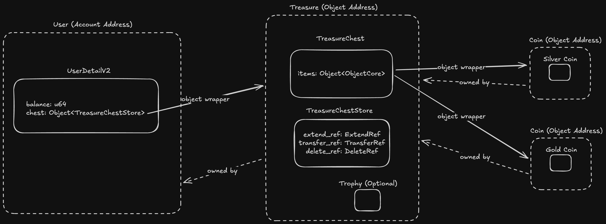

# Object Basics: Refs And More

Till now, we talked about how to create and use objects. However, when it comes to building secure applications we also need to determine what all behaviours are possible on a set of objects. Let's walkthrough our new [codebase](../demos/treasure-hunt-ii) to understand it in depth.

## Explaining the Changes

On [day 9](UsingScripts.md) we talked about the limitation with our existing design and how we introduced an entirely new structs for resources. Let's understand how those resources will be stored moving forward.

### Creation Of Treasure Hunt

If we check the source code for creation of treasure hunt the following lines have been added.

```Move
let (_, constructor_ref) = create_object(sender, TreasureChest {
    items: vector::empty<Object<ObjectCore>>()
});

// Creates ref for transfer, deletion and extending
let transfer_ref = object::generate_transfer_ref(constructor_ref);
let extend_ref = object::generate_extend_ref(constructor_ref);
let delete_ref = object::generate_delete_ref(constructor_ref);

let store_signer = &object::generate_signer(constructor_ref);

// Disable ungated transfer i.e. no transfer without LinearTransferRef
object::disable_ungated_transfer(&transfer_ref);

move_to(store_signer, TreasureChestStore{
    transfer_ref,
    extend_ref,
    delete_ref  
});
```

We changed the `create_object` method to return a `ConstructorRef` along with the object, we then used this ref to generate `transfer_ref`, `extend_ref`, `delete_ref`. So what are these `Refs`. `Refs` are nothing but resources given by the `Object` framework which can perform certain set of actions on the objects. Each ref can be categorized as follows.

- `ExtendRef`- Any user having this ref can add more resources on the given object address. This ref can be used to generate a signer which can add resources to the given object address.
- `DeleteRef` - Any user having this ref can delete an object address making it unusable for any more operations. Note that, this ref only guarantees deletion of `ObjectCore` resource. User's can still access there resource present in the address, however they can't add newer resources to the address or perform any object related function on the address.
- `TransferRef` - This ref is used to control transfer privileges for a given object address. It performs 2 functions.
  - Enable or Disable `ungated_transfers`. Ungated transfer basically implies that owner's of the object can transfer the ownership to another address without using any `Refs` if enabled. This can allow the owner's of the object to transfer the ownership outside the scope of the package.
  - `TransferRef` is also used to generate `LinearTransferRef`. In case `ungated_transfers` are disabled, users can transfer the object from one address to another only using `LinearTransferRef` generated that too only once. This gives a lot of control to packages to allow transfer of ownership only in limited scope.

```Move
let transfer_ref = object::generate_transfer_ref(constructor_ref);
let extend_ref = object::generate_extend_ref(constructor_ref);
let delete_ref = object::generate_delete_ref(constructor_ref);
```

We call `generate_transfer_ref`, `generate_extend_ref` and `generate_delete_ref` to create the `TransferRef`, `ExtendRef` and `DeleteRef` respectively.

```Move
object::disable_ungated_transfer(&transfer_ref);
```

Using `TransferRef` we also disable `ungated_transfers` to avoid any uncontrolled transfer of ownership.

Post, the code migration our resources will look like shown below in the address space.



Here, dotted line represent the ownership. Note that, all the resources created in the same object address will always have the same owner. Let's try to understand about the Refs in detail.

### Creation of Coins

We haven't made much changes in `mint_coin_for_treasure` function. Only change made was to make the object created untransferrable by calling `set_untransferable` just after the ownership is transferred. This prohibits the coins to be transferred to any other address in any criteria whatsoever.

```Move
// Transfer the ownership to treasure chest.
object::transfer_to_object(sender, coin_object, chest_object);

// Remove transferrable privileges for coin.
object::set_untransferable(coin_creator_ref);

```

## Minting Trophies

In our package we have given the capability for the users to mint trophy for a given treasure chest. This operation is expensive as it as cost of `10` units so user's can opt to do it for a specific treasure chest using `mint_trophy_for_treasure`. In order to understand how to use `ExtendRef`we can see this function in detail.

```Move
public entry fun mint_trophy_for_treasure(sender: &signer, chest_object: Object<TreasureChest>) acquires UserDetailV2, TreasureChestStore {
    let user_detail = fetch_user_detail(sender);

    let chest_object_address = object::object_address(&chest_object);

    if(object::object_exists<Trophy>(chest_object_address)) return ();
    assert!(
        user_detail.balance >= TREASURE_TROPHY_PRICE, 
        error::aborted(E_INSUFFICENT_BALANCE)
    );

    let treasure_chest_store = fetch_treasure_chest_store_from_object(sender, chest_object);

    // Generate a signer to the same object address using ExtendRef
    let trophy_creator_signer = &object::generate_signer_for_extending(&treasure_chest_store.extend_ref);

    move_to(trophy_creator_signer, Trophy{});
    user_detail.balance = user_detail.balance - TREASURE_TROPHY_PRICE;
}
```

In this funtion we call `generate_signer_for_extending` which takes in `&ExtendRef`. This signer then allows us to add resources to the `chest_object` address if not already present.

User's can use `ExtendRef` to extend i.e to add more resources in a object address for which they have the ref for.

### Deleting Treasures

We have also added the capability to delete treasure chest for a given user to restore their balance. Let's check out `burn_treasure`

```Move
public entry fun burn_treasure(sender: &signer, chest_object: Object<TreasureChest>) acquires UserDetailV2, TreasureChest, TreasureChestStore, Trophy {
    let user_detail = fetch_user_detail(sender);
    let sender_address = signer::address_of(sender);

    assert!(object::is_owner(chest_object, sender_address), error::permission_denied(E_NOT_OWNER));
    let treasure_chest_store_address = object::object_address(&chest_object);
    let treasure_chest_store_object: Object<TreasureChestStore> = object::convert(chest_object);

    let (chest_exist, chest_index) = vector::index_of(&user_detail.chests, &treasure_chest_store_object);
    assert!(chest_exist, error::not_found(E_CHEST_NOT_FOUND));

    let chest_balance = total_treasure_cost(sender_address, chest_object); 

    // Delete and unpack  all the existing resources.
    let TreasureChestStore{delete_ref, extend_ref: _, transfer_ref: _} = move_from<TreasureChestStore>(treasure_chest_store_address);
    let TreasureChest{items: _} = move_from<TreasureChest>(treasure_chest_store_address);

    if(exists<Trophy>(treasure_chest_store_address)) {
        let Trophy{} = move_from<Trophy>(treasure_chest_store_address);
    };

    vector::remove(&mut user_detail.chests, chest_index);

    // Restore the balance for the resources burned
    user_detail.balance = user_detail.balance + chest_balance;

    // Delete the object from address
    object::delete(delete_ref);
}
```

In this function, once we have removed the resources from the `chest_object` address.

```Move
// Delete and unpack  all the existing resources.
let TreasureChestStore{delete_ref, extend_ref: _, transfer_ref: _} = move_from<TreasureChestStore>(treasure_chest_store_address);
let TreasureChest{items: _} = move_from<TreasureChest>(treasure_chest_store_address);

if(exists<Trophy>(treasure_chest_store_address)) {
    let Trophy{} = move_from<Trophy>(treasure_chest_store_address);
};

vector::remove(&mut user_detail.chests, chest_index);

// Restore the balance for the resources burned
user_detail.balance = user_detail.balance + chest_balance;
```

We call the `delete` function which takes in `DeleteRef`. This function then deletes the `ObjectCore` resource from the address making it unusable for any future object related operations.

**Note**

_If there is any resource present in the deleted address, those resources can still be accessed using global operators. However, running any object functions will throw an error._

### Transfering Treasures

Lastly users can transfer treasures from one user to other. This is a 2-step process as shown in the `transfer_treasure` function.

```Move
public entry fun transfer_treasure(sender: &signer, chest_object: Object<TreasureChest>, to: address) acquires UserDetailV2, TreasureChest, TreasureChestStore {
    let user_detail = fetch_user_detail(sender);
    let sender_address = signer::address_of(sender);

    let treasure_chest_store = fetch_treasure_chest_store_from_object(sender, chest_object);
    let treasure_chest_store_object: Object<TreasureChestStore> = object::convert(chest_object);

    let (chest_exist, chest_index) = vector::index_of(&user_detail.chests, &treasure_chest_store_object);
    assert!(chest_exist, error::not_found(E_CHEST_NOT_FOUND));
    let chest_balance = total_treasure_cost(sender_address, chest_object);

    // Transfer ownership using LinearTransferRef
    let linear_transfer_ref = object::generate_linear_transfer_ref(&treasure_chest_store.transfer_ref);
    object::transfer_with_ref(linear_transfer_ref, to);
  
    // Remove the treasure chest from existing user
    vector::remove(&mut user_detail.chests, chest_index);

    // Restore the balance for the resources burned for old user
    user_detail.balance = user_detail.balance + chest_balance;

    // Burn the balance for new user
    let to_user_detail = fetch_user_detail_from_address(to);
    assert!(to_user_detail.balance >= chest_balance, error::aborted(E_INSUFFICENT_BALANCE));
  
    to_user_detail.balance = to_user_detail.balance - chest_balance;
    vector::push_back(&mut to_user_detail.chests, treasure_chest_store_object);
}
```

In this function first we generate a `LinearTransferRef` to make controlled transfer using `generate_linear_transfer_ref`. Then we use `LinearTransferRef` to call `transfer_with_ref` to transfer the ownership in a controlled manner. This allows the transfers to only happen whenever the user has access to `TransferRef` or `LinearTransferRef`. User's can't transfer ownership just by writing scripts in this case or if not allowed by the package.

## Summary

Today, we learnt about

- What are `Refs` in Object Framework
- How to create and store `Refs`
- How to Extend, Transfer and Delete Objects using `Refs`

## Resources

- [Customizing Object Features](https://aptos.dev/en/build/smart-contracts/object/creating-objects#customizing-object-features)
- [Object Reference](https://aptos.dev/en/build/smart-contracts/move-reference?page=aptos-framework/doc/object.md)
- [Object Source Code](https://github.com/aptos-labs/aptos-core/blob/mainnet/aptos-move/framework/aptos-framework/sources/object.move)
