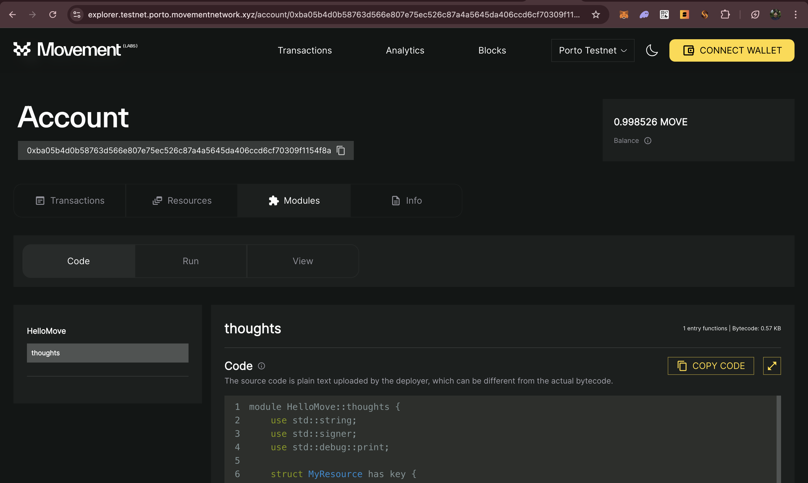
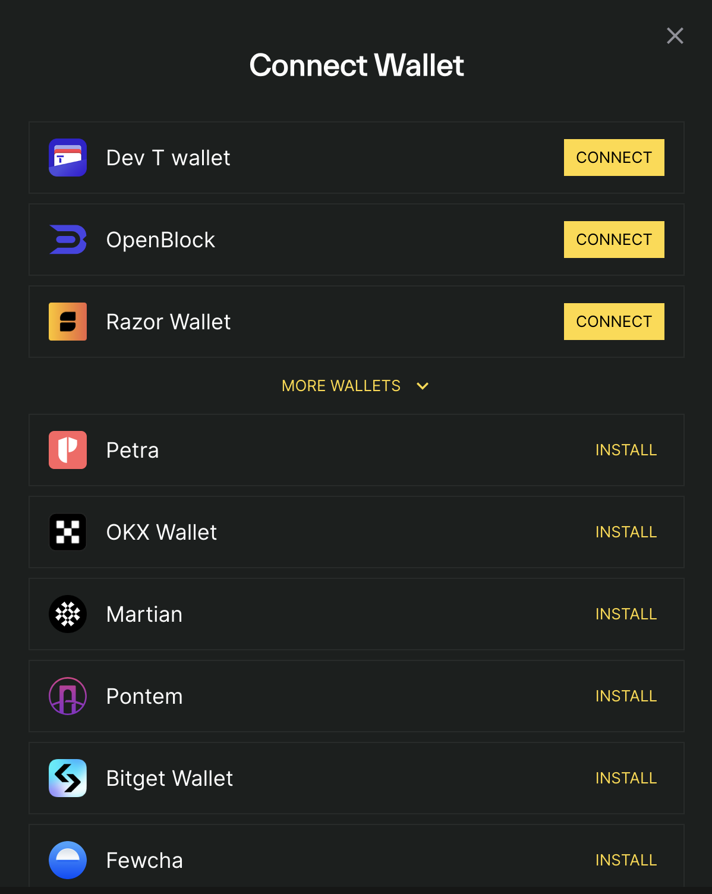
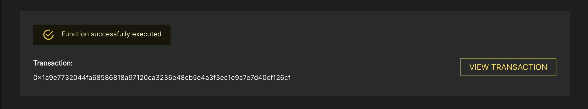
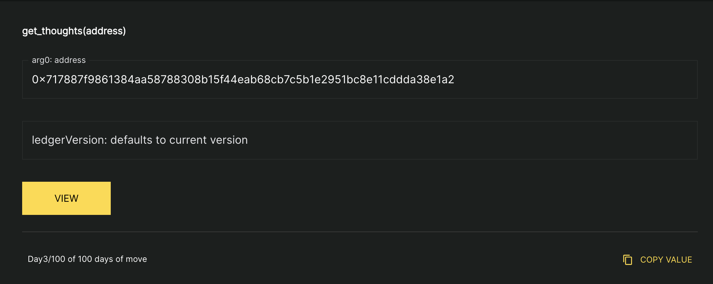

# Hello move on Testnet

On [day 2](https://github.com/code-xD/100-days-of-move/blob/main/docs/HelloMove.md) we learnt how to create your first module. Today we'll publish the module on the [Movement Porto testnet](https://explorer.testnet.porto.movementnetwork.xyz/) and interact with it using cli and explorer.

## Publishing the module
- To publish the module that we created we first need to go inside the folder
```
cd demos/hello-move
```
- We will need to change **Move.toml** so that the address that the module is published is the address that we created using `move init` in the last tutotial.
```
Move.toml

[addresses]
aptos_framework = "0x1"
std = "0x1"
HelloMove = "<Address_created>"
```
- For publishing a package run the following command
```
movement move publish
```
- When you get this prompt type `yes`
```
Do you want to submit a transaction for a range of [147400 - 221100] Octas at a gas unit price of 100 Octas? [yes/no] >
```
- The output should look like this
```
Transaction submitted: https://explorer.movementlabs.xyz/txn/0x45bdd664187115255ed66a0109b0ba2e69d2c3bff8a9ba8f057ca166a01fa299?network=custom
{
  "Result": {
    "transaction_hash": "0x45bdd664187115255ed66a0109b0ba2e69d2c3bff8a9ba8f057ca166a01fa299",
    "gas_used": 1474,
    "gas_unit_price": 100,
    "sender": "ba05b4d0b58763d566e807e75ec526c87a4a5645da406ccd6cf70309f1154f8a",
    "sequence_number": 0,
    "success": true,
    "timestamp_us": 1735979695270784,
    "version": 223388642,
    "vm_status": "Executed successfully"
  }
}
```
Congrats on publishing your first move module!

## Interact with the module
- To see your module you can go to the [explorer](https://explorer.testnet.porto.movementnetwork.xyz/?network=testnet) and enter your address that you mentiond in Move.toml.
- You should see something like this

- The module is published on your address.

There are two ways to interact with your module. Let's explore them:
### Using Explorer
#### Storing your thought
- To store your thought you'll need to send a transaction. Connect your wallet using the connect wallet button.
- For this tutorial I am using [razorwallet](https://razorwallet.xyz/), you can use any other wallet as well

- After connecting the wallet go to `Run` and enter your thought of the day in the box and press `RUN`. You'll see a pop up to approve the transaction. 

- After appoving you can see your succesful transaction


Congrats on sending your first transaction using the explorer!
#### Reading your thought
- To read the thought go to view page
- Enter the address that you used to create the thought and press view
- You'll be able to see your thought of the day

### Using cli
Now lets try the same action using movement cli

#### Storing your thought
- Run the following command from the terminal. Replace the arguments:
  - **Address_created**: Address you put in Move.toml on which your module is published
  - **Thought of the day**: Your thought of the day
```
movement move run --function-id <Address_created>::thoughts::create_thoughts --args string:'<Thought of the day>'
```
- You'll see the output on the console
```
Transaction submitted: https://explorer.movementlabs.xyz/txn/0x7135c3da36b24efd97061d0a27104270794cdbde7ca04a5915e99d306f3fdd72?network=custom
{
  "Result": {
    "transaction_hash": "0x7135c3da36b24efd97061d0a27104270794cdbde7ca04a5915e99d306f3fdd72",
    "gas_used": 449,
    "gas_unit_price": 100,
    "sender": "ba05b4d0b58763d566e807e75ec526c87a4a5645da406ccd6cf70309f1154f8a",
    "sequence_number": 1,
    "success": true,
    "timestamp_us": 1735986758541060,
    "version": 223776158,
    "vm_status": "Executed successfully"
  }
}
```
Congrats! You just created a tx using movement cli as well

#### Reading your thought
- Run the following command from the terminal. Replace the arguments:
  - **Address_created**: Address you put in Move.toml on which your module is published
```
movement move view --function-id <Address_created>::thoughts::get_thoughts --args address:<Address_created>
```
- You'll see the following output on the cli. _The below output is what I entered as my thought_
```
{
  "Result": [
    "Day3/100 thought from cli"
  ]
}
```

## Summary
After this tutorial you'll be able to do following things:
1. Publish your own modules
2. Store a variable mapped to account address
3. Read the variable mapped to account address
4. Use movement explorer to interact with move contracts

Let's continue building on this and move forward with our 100 days of move!