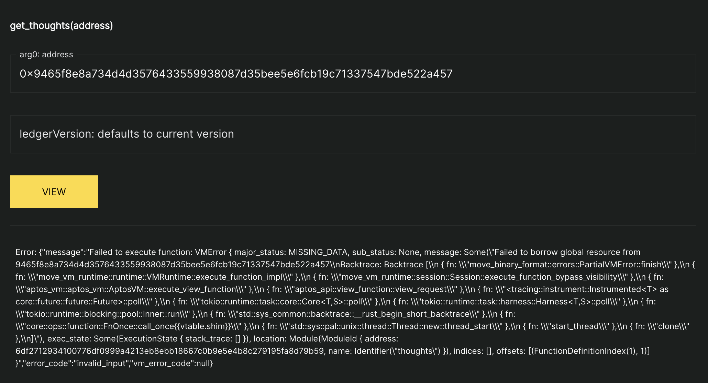
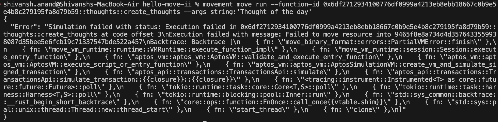
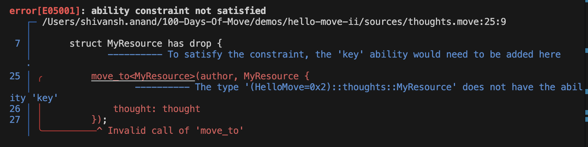
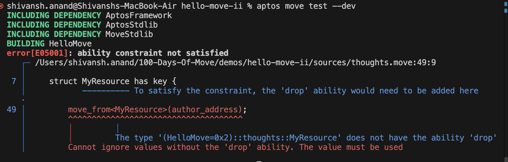

# Understanding Storage

On [Day 3](PublishPackage.md) we talked about to deploy our package to the testnet and how to interact with it using the explorer and CLI. However, we still have some issues to resolve, let's figure them out together.

Let's open the explorer and try to fetch thoughts for an address who hasn't posted any thoughts yet.



Let's try to create a thought even though we have already published one with the same address. This time we will be using the CLI to do the same.



Both the cases are failing as they ought to but the errors are not descriptive enough. When designing client-side application we would need descriptive error codes to handle specific use cases.

Apart from that it would be good idea to provide users the ability to edit and delete their thoughts. Let's address these issues.

## Upgrading Your Package

First, let's go to our package with the updated code present at [hello-move-ii](../demos/hello-move-ii). Now let's replace the address of `HelloMove` keyword in `Move.toml` as highlighted in previous [tutorial](PublishPackage.md#publish-package-publish-your-module).

Once replaced the address with address of your profile run the deployment command again.

```bash
movement move publish
```

This should upgrade the existing code for our package. But upgrade? Yes, movement has the capability to upgrade your packages. However, there are certain conditions which need to be strictly met in order for the package upgrade to take place successfully.

1. The function signature for existing entry functions should remain unchanged.
2. The struct for globally stored resources should be unchanged.

To know more about the rules and policies for package upgrade check out the [resources](#understanding-storage-resources).

## Testing Out the Changes

Let's re-test our code using the CLI to see the expected output.


On trying to re-create a thought we are getting a much descriptive error `E_THOUGHT_ALREADY_EXIST` now. This will make the client side development much easier for us.

## Code Overview

If you have made it this far congratulations!!! We have till now learned about our to upgrade our packages and test out our new changes. Let's now do a deeper dive into our code and understand what is going on.

### Structs and Abilities

In our `thoughts` we have always made this declaration in the beginning.

```Move
struct MyResource has key, drop {}
```

One can read the above declaration as follows `MyResource is a struct has key and drop ability`.

**What is a Struct?**

In Move, a struct is a user-defined data structure that contains typed fields. Structs can store any non-reference type, including other structs.

**What is an ability?**

Move is a strongly typed language and also gives you control on what all operations you can perform on a given type. These operations are defined by abilites. Move as following abilities -

- key - Any type having key ability can be stored in Global Persistent Storage.
- store - Any type having store ability can be stored in Global Persistent Storage but only as a member of another struct and not directly.
- copy - Any type having copy ability and be copied across multiple variables.
- drop - Any type having drop ability can be dropped from memory without being explicity unpacked.

In our example above `MyResource` has `key` ability because which allows us to add it to the Global Storage. Removing the `key` ability will cause failure in compilation of our program as it would no longer have the permission to store `MyResource` to the Global Storage.



As one can see we get error in compiling the code, since `MyResource` struct needs `key` ability to be stored.



Similarly, the `MyResource` should have the `drop` ability in order for it to be removed from the storage.

### Global Storage and Resources

We have been talking about `Global Storage` for a very long while but what it is. Any blockchain has a persistant secure database from which one could set and retrieve values.

Movement has a tree-shaped persistent global storage to which users add and retrieve data from. Programs cannot access the filesystem, network, or any other data outside of this tree. This ensures that resources are accessed securely and can't be tampered.

In order to interact with Global Storage, Move language has 4 native functions which can be used.

- `move_to<T>(&signer, T)` - To move a resource of type `T` to global storage.
- `move_from<T>(address)` - To remove a resource of type T at a given `address` from global storage.
- `borrow_global<T>(address): &T` - To get a immutable (read-only) reference of a resource of type `T` at a given `address`. It is used to access the data of a given resource.
- `borrow_global_mut<T>(address): &mut T` - To get a mutable (read-and-write) reference of a resource of type T at a given `address`. It is used to edit the data of a given resource.
- `exists<T>(address): bool` - Returns true/false to check if a given resource is present at an address.

We can see the `edit_thoughts` function to get a much better understanding.

```Move
// User wants to edit his thoughts.
public entry fun edit_thoughts(author: &signer, thought: string::String) acquires MyResource {
    // Check if there is a thought present under author's address.
    let author_address = signer::address_of(author);

    // Check if there is a thought present under author's address.
    let thought_already_exists = exists<MyResource>(author_address);

    // Throw error if it does not.
    assert!(thought_already_exists, error::not_found(E_THOUGHT_NOT_FOUND));

    // Get an mutable reference for the thought at author's address.
    let author_thought = borrow_global_mut<MyResource>(author_address);

    // Edit the thought, since it is a mutable reference the resource will be updated automatically.
    author_thought.thought = thought;
}
```

Here we check if the a resource of type `MyResource` is present at `author_address` as seen in this line

```Move
let thought_already_exists = exists<MyResource>(author_address);
```

Once, we see that it's true, borrow a mutable reference from global storage at `author_address` and edit the thoughts. As seen in the snippet below.

```Move
// Get an mutable reference for the thought at author's address.
let author_thought = borrow_global_mut<MyResource>(author_address);

// Edit the thought, since it is a mutable reference the resource will be updated automatically.
author_thought.thought = thought;
```

Similarly, we can see the `delete_thoughts` function to understand the usage of `move_from` function.

**What is Resource?**

Any initialized Struct stored to Global Storage is called a Resource. In Move we can access Resources across packages but we can only add, modify, access it's field and delete a given resource only in the Package where they are defined. This rule gives accessibility and security to a Resource meaning everyone can view and store a given Resource but can't modify it.

### Error Handling

One could see the in the code we use the following package.

```Move
use std::error;
```

Movement provides us with an error package which we can use to wrap our errors in pre-defined error codes, just like we do it with HTTP code. For example, `5xx` means an internal error, `4xx` means a validation error. This helps to standardise errors in our Move Packages.

But how do we throw an error? Move gives us 2 functions `assert` and `abort` to achieve these use-cases.

```Move
use std::vector;
fun pop_twice<T>(v: &mut vector<T>): (T, T) {
    if (vector::length(v) < 2) abort 42;

    (vector::pop_back(v), vector::pop_back(v))
}
```

As seen in the code snippet above we can perform basic checks and throw an error code using `abort`.

`abort` function has given function signature `abort code: u64`

Similarly we can use `assert` function to throw an error when a given error is not met. `assert` has following function signature `assert!(condition: bool, code: u64)`

In our **HelloMove** example there are multiple snippets where we have used `assert` function to fulfill our use-case.

```Move
// Check if there is a thought present under author's address.
let thought_already_exists = exists<MyResource>(user);

// Throw error if it does not.
assert!(thought_already_exists, error::not_found(E_THOUGHT_NOT_FOUND));
```

In `get_thoughts` functions we check if a resource exists at `user` address. However, if it doesn't exist we should throw an error to inform our client.

```Move
assert!(thought_already_exists, error::not_found(E_THOUGHT_NOT_FOUND));
```

This line tells to abort the function with a `not_found` code specifically with `E_THOUGHT_NOT_FOUND` error.

Similarly in unit tests we can use `expected_error` tag to pass a unit test specifically when the function throws an error. This helps us to cover negative tests as well.

```Move
// Test if we are able to delete our thoughts
#[test(aaron = @0xcafe)]
#[expected_failure(abort_code = 0x60002, location = HelloMove::thoughts)]
fun test_delete_flow(aaron: &signer) acquires MyResource {
    let aaron_address = signer::address_of(aaron); 

    let thought = b"Hello Move";

    create_thoughts(aaron, string::utf8(thought));
    let aaron_thought = get_thoughts(aaron_address);
    assert!(aaron_thought == string::utf8(b"Hello Move"), 1);

    delete_thoughts(aaron);
    let _ = get_thoughts(aaron_address);
}
```

We know that after deleting thought for a given user we should get an error when trying to fetch thought for that user, since there is not thought present for that user. We can emulate this behaviour in unit tests using the `expected_failure` command.

```Move
#[expected_failure(abort_code = 0x60002, location = HelloMove::thoughts)]
```

Here we tell the error_code which the execution would return and location of the module returning the code. Since `not_found` error starts with `0x6` error code and `E_THOUGHT_NOT_FOUND` has an error code of 2. The expected error would be `0x6 | 0x00002` which is or of both the codes yielding the error code `0x60002` starting with 6 and ending with 2

## Summary

In today's session we learned following things -

- How to Upgrade your Package
- How to modify your Global Storage
- Understood briefly about Structs and Abilities
- How to handle error.
- How to emulate failure scenarios in Unit Tests.

## Resources <a id="understanding-storage-resources"></a>

- [Package Upgrades](https://aptos.dev/en/build/smart-contracts/book/package-upgrades#compatibility-rules)
- [Structs](https://move-language.github.io/move/structs-and-resources.html)
- [Global Storage Operators](https://move-language.github.io/move/global-storage-operators.html)
- [Type Abilities](https://move-language.github.io/move/abilities.html)
- [Abort and Asset](https://move-language.github.io/move/abort-and-assert.html)
