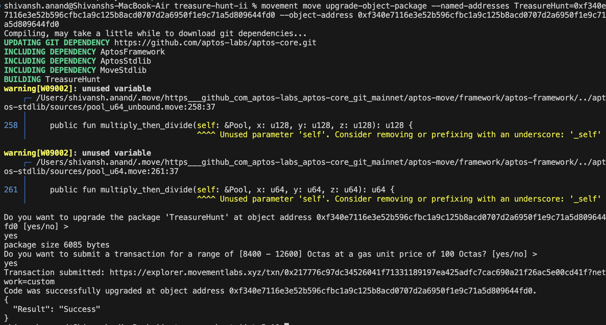
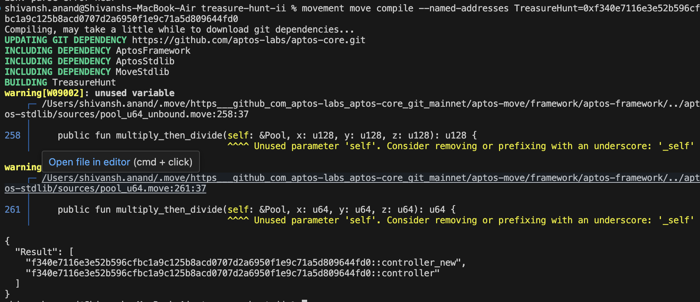
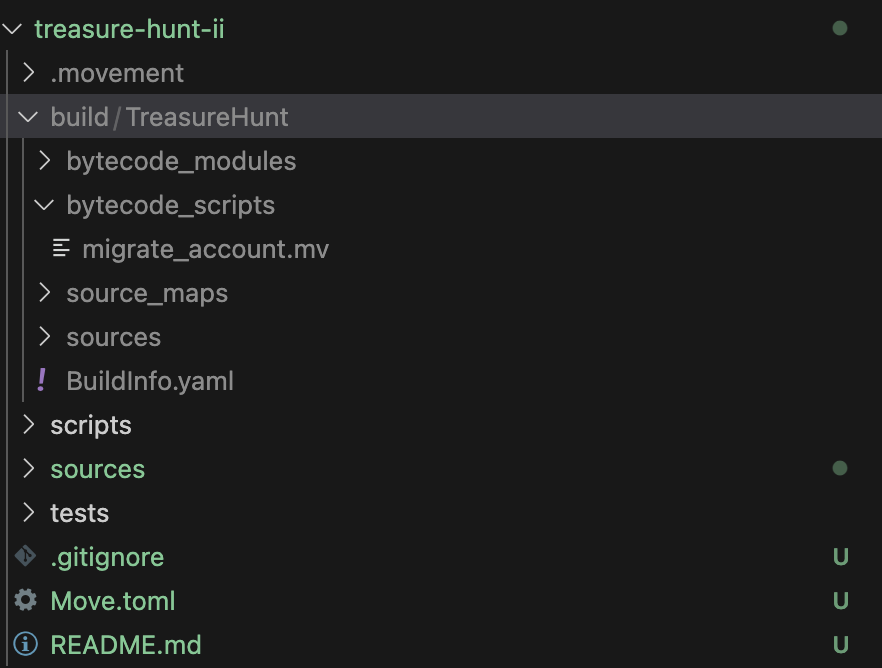
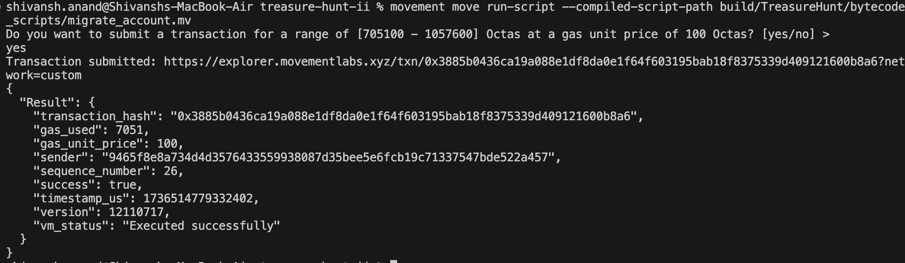

# Using Scripts

On [day 8](ObjectBasics.md) we talked about how to create and add resources to object, and understood how to transfer ownerships. Before we move forward to understand more capabilities of Object framework we need to upgrade our code.

## Setting Up

### Limitations

If we review our previous [codebase](../demos/treasure-hunt), our resources store very limited information.

```Move
struct TreasureChest has key {
    items: vector<Object<ObjectCore>>
}
```

However, in order to tweak behaviour for our objects we need some additional Refs. This can't be enterained because according to movement we can't change the struct of existing Resources. In order to tackle this we need to create a new Resource altogether which stores all the additional informations.

### Upgrading Our Package

Just like we upgraded our packages with accounts, we can also upgrade our packages in object based deployment. Also the rules for upgradation remains the same.

Navigate to [treasure-hunt-ii](../demos/treasure-hunt-ii)

In order to run our upgradation we have to run the following command.

```bash
movement move upgrade-object-package --named-addresses TreasureHunt=<package_address> --object-address <package_address>
```

Post running the command we should get the following output.



### Migrating our Existing User

Once, we upgrade our packages, we come across another problem. What about the users which were registered in the older code base?

In order to tackle that we need to create and run a migration script.

**What Are Scripts?**

A script is a block of move code which has one function which can be invoked to call multiple functions from various packages. Unlike Modules, scripts aren't deployed to the blockchain and are just executed at the runtime.

Scripts have flexilibity to call any `public` function from any package. A script file is a move file which has the following structure.

```Move
script {
    <use>*
    <constants>*
    fun <identifier><[type parameters: constraint]*>([identifier: type]*) <function_body>
}
```

We have already created [migration.move](../demos/treasure-hunt-ii/sources/migration.move) script. This script can be invoked by any user who want to migrate their details from old resources to new ones in a non-custodial fashion.

**Steps to Run**

First we run the compile command.

```bash
movement move compile --named-addresses TreasureHunt=<package_address>
```



Post compilation we should see the compiled script function in build folder which will be named `migrate_account.mv`.



Finally, we call the script function with the signer who want to migrate there details.

```bash
movement move run-script --compiled-script-path build/TreasureHunt/bytecode_scripts/migrate_account.mv
```



## Summary

Today, we talked about.

- How to upgrade packages deployed using objects.
- Introduction to Scripts.
- Compilation and Invocation of Scripts.

## Resources

- [Scripts Structure](https://aptos.dev/en/build/smart-contracts/book/modules-and-scripts#scripts)
- [Deployment and Running Scripts](https://aptos.dev/en/build/smart-contracts/scripts/script-tutorial)
- [Upgrading Object Deployments]()
